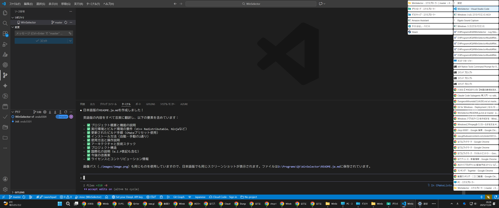

# WinSelector

Qt6で構築されたWindows 11向けの軽量でカスタマイズ可能な代替タスクバー。WinSelectorは、画面右端の縦型パネルにすべての開いているウィンドウをクリック可能なタイルとして表示します。

## 機能

- **クリーンでモダンなインターフェース**: デスクトップに馴染むフレームレスの半透明パネル
- **ウィンドウ管理**: すべての開いているウィンドウをアイコンとタイトルで一目で確認
- **クイックウィンドウ切り替え**: タイルをクリックするだけでそのウィンドウを前面に表示
- **コンテキストメニュー操作**: 右クリックでパネルから直接ウィンドウを閉じることが可能
- **スマートグループ化**: ウィンドウはプロセス名で自動的にグループ化
- **常に最前面**: パネルは他のウィンドウの上に表示され、即座にアクセス可能
- **自動更新**: ウィンドウリストは2秒ごとに更新され、システムの変化を反映
- **縦型フローレイアウト**: ウィンドウは縦に配置され、必要に応じて新しい列に折り返し
- **グローバルショートカット**: Homeキーで表示/非表示を瞬時に切り替え

## スクリーンショット



## 必要要件

### 実行環境
- Windows 11（またはWindows 10）
- Microsoft Visual C++ 2015-2022 再頒布可能パッケージ (x64)

### ビルド環境
- CMake 3.16以上
- Ninja
- Qt6（Widgetsモジュール付き）
- MSVC 2022またはC++17互換コンパイラ
- Windows SDK（Win32 API用）

## ソースからのビルド

### 1. Qt6のインストール

[qt.io](https://www.qt.io/download)からQt6をダウンロードしてインストールします。MSVC 2022 64ビットコンポーネントを必ずインストールしてください。

### 2. 環境変数の設定（オプション）

開発を容易にするため、`QT_SDK_DIR`環境変数を設定します：

```cmd
set QT_SDK_DIR=C:\path\to\Qt\6.x.x\msvc2022_64
```

### 3. 構成とビルド

```cmd
cmake --preset Debug_Windows
cmake --build ./build/Debug_Windows
```

実行ファイルは`./build/Debug_Windows/WinSelector.exe`に生成されます。

## インストール

### 方法1: Qt依存関係を含むインストール

```cmd
cmake --preset Release_Windows
cmake --build ./build/Release_Windows --target install
```

これにより`windeployqt`が自動的に必要なすべてのQt DLLをインストールディレクトリにコピーします。

### 方法2: 手動デプロイ

1. `./build/Release_Windows/output/bin/WinSelector.exe`を任意の場所にコピー
2. Qt6 DLLをシステムPATHに追加するか、実行ファイルと同じ場所にコピーします：
   - Qt6Core.dll
   - Qt6Gui.dll
   - Qt6Widgets.dll
   - icuuc.dll
   - プラットフォームプラグイン（platforms/フォルダのqwindows.dll）

## 使用方法

`WinSelector.exe`を実行するだけです。パネルが画面の右端に表示されます。

- **Homeキー**: パネルの表示/非表示を切り替え
- **左クリック**: ウィンドウタイルをクリックして、そのウィンドウをアクティブ化し前面に表示
- **右クリック**: ウィンドウタイルを右クリックしてコンテキストメニューを表示し、ウィンドウを閉じる
- パネルは自動的に更新され、新しいウィンドウを表示し、閉じられたウィンドウを削除します

アプリケーションを終了するには、システムタスクバーまたはタスクマネージャーから閉じてください。

## 設定

WinSelectorは`Settings.ini`ファイルを通じてカスタマイズできます。このファイルは初回実行時にデフォルト値で自動的にアプリケーションディレクトリに作成されます。

### Settings.ini 設定オプション

```ini
[MainWindow]
# ウィンドウリストの更新間隔（ミリ秒）
RefreshIntervalMs=2000

# ウィンドウを閉じた後にリストを更新するまでの遅延時間（ミリ秒）
CloseRefreshDelayMs=500

# パネルの初期幅（ピクセル）
InitialWidth=300

# パネルの最小幅（ピクセル）
MinimumWidth=300

[Layout]
# レイアウトの周囲の余白（ピクセル）
Margin=2

# タイル間の水平方向の間隔（ピクセル）
HSpacing=2

# タイル間の垂直方向の間隔（ピクセル）
VSpacing=2

[WindowScanner]
# ウィンドウタイトルの最大長
MaxTitleLength=256

[WindowTile]
# 各ウィンドウタイルの幅（ピクセル）
Width=250

# 各ウィンドウタイルの高さ（ピクセル）
Height=30

# ウィンドウアイコンのサイズ（ピクセル）
IconSize=16

# 各タイル内のコンテンツ余白（ピクセル）
ContentMargin=2

# アイコンとタイトル間の内部間隔（ピクセル）
InternalSpacing=5

[Shortcuts]
# パネルの表示/非表示を切り替えるショートカットキー
# サポートされるキー: Home, End, Left, Right, Up, Down, PageUp, PageDown,
#                     Insert, Delete, Space, Backspace, Return, Enter, Escape, Tab,
#                     F1-F12, A-Z, 0-9
ToggleVisibility=Home
```

### カスタマイズ例

**パネル幅とタイルサイズを大きくする:**
```ini
[MainWindow]
InitialWidth=400
MinimumWidth=400

[WindowTile]
Width=350
Height=40
IconSize=24
```

**トグルショートカットをF12に変更する:**
```ini
[Shortcuts]
ToggleVisibility=F12
```

**よりコンパクトなレイアウトにするために間隔を狭める:**
```ini
[Layout]
Margin=1
HSpacing=1
VSpacing=1
```

`Settings.ini`の変更を有効にするには、アプリケーションの再起動が必要です。

## アーキテクチャ

### コアコンポーネント

- **MainWindow**: 画面右端に配置されるルートウィンドウコンテナ
- **WindowScanner**: Win32 APIを使用してすべての表示可能なウィンドウを列挙するユーティリティクラス
- **WindowTile**: アイコンとタイトルを持つ各開いているウィンドウを表す個別のウィジェット
- **FlowLayout**: 縦折り返しタイル配置用のカスタムレイアウトマネージャー

### 使用技術

- **Qt6 Framework**: クロスプラットフォームUIフレームワーク
- **Win32 API**: ウィンドウの列挙と管理のためのネイティブWindows API
  - EnumWindows、IsWindowVisible、GetWindowLongPtr
  - SetForegroundWindow、ShowWindow
  - プロセス情報取得のためのProcess Status API (Psapi)

## 開発

### プロジェクト構造

```
WinSelector/
├── src/
│   ├── main.cpp              # アプリケーションエントリーポイント
│   ├── mainwindow.{h,cpp,ui} # メインウィンドウ実装
│   ├── windowscanner.{h,cpp} # ウィンドウ列挙ロジック
│   ├── windowtile.{h,cpp}    # ウィンドウタイルウィジェット
│   ├── flowlayout.{h,cpp}    # カスタム縦フローレイアウト
│   ├── win32utils.{h,cpp}    # Win32 APIユーティリティ
│   ├── settings.{h,cpp}      # 設定管理
│   └── config.h              # 設定アクセサ関数
├── resources/
│   ├── WinSelector_ja_JP.ts  # 日本語翻訳
│   ├── resources.qrc         # Qtリソースファイル
│   └── WinSelector.rc        # Windowsリソースファイル
├── Settings.ini              # ユーザー設定ファイル（自動生成）
└── CMakeLists.txt            # ビルド設定
```

### 国際化

**W.I.P**

プロジェクトはQtの翻訳システムを通じて日本語ローカライゼーションをサポートしています。言語を追加するには：

1. `resources/`に新しい`.ts`ファイルを作成
2. CMakeLists.txtの`TS_FILES`に追加
3. `lupdate`を実行して翻訳可能な文字列を抽出
4. Qt Linguistを使用して翻訳

### 今後の改善

- **パフォーマンス**: 毎回すべてのタイルを再作成するのではなく、差分更新を実装
- **設定画UI**: より簡単な設定のためのグラフィカル設定ダイアログを追加
- **フィルタリング**: ウィンドウをフィルタリングまたは検索する機能を追加
- **マルチモニター**: 異なるモニターへの配置をサポート
- **テーマ**: カスタマイズ可能な配色と透明度レベル

## ライセンス

[MIT](LICENSE)

## コントリビューション

コントリビューションを歓迎します！イシューやプルリクエストをお気軽に提出してください。

## 謝辞

- FlowLayoutの実装はQtのフローレイアウトサンプルを参考にしています
- 優れたQtフレームワークで構築されています
