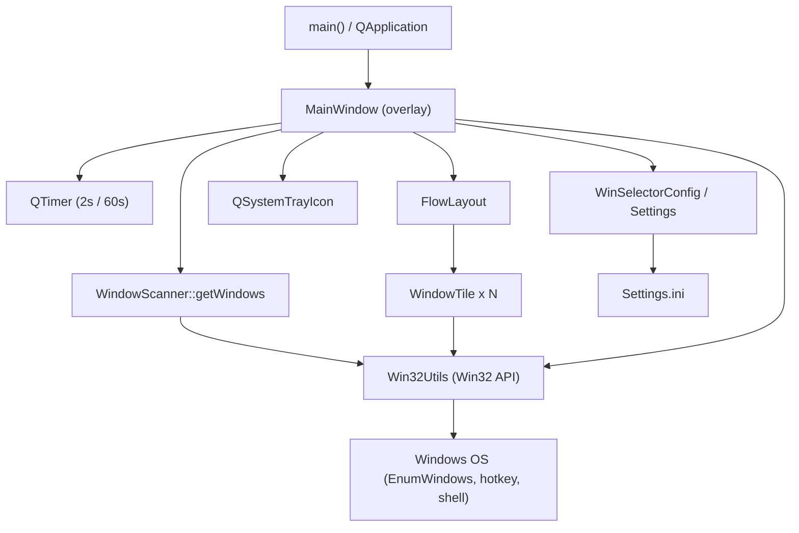

# 01 概要

## 1.1 アプリケーションの目的

WinSelector は Windows 専用の Qt6 デスクトップアプリケーションで、Windows 11 で
使いづらくなったタスクバーの代替として、起動中の全ウィンドウを画面端のタイル列
として表示する常駐ツールである [REF: Specifications.txt:5-11]。各タイルは
「ウィンドウのアイコン」+「タイトル(またはアプリ名)」で構成され、クリックで
当該ウィンドウをアクティブ化できる [REF: Specifications.txt:15-16]。

- 解決する課題: 多数のウィンドウを開いた状態で、目的のウィンドウへ素早く切り替え
  たい/閉じたいという要求。標準タスクバーよりも一覧性の高い縦並びパネルで対応する
  [REF: Specifications.txt:19-20]。
- 主たる利用者: Windows 11 のヘビーユーザー(多ウィンドウ運用者)。
  [CONFIDENCE: MED] 想定利用者は仕様書の趣旨から推定 [REF: Specifications.txt:11]。
- 対応プラットフォーム: Windows のみ。ビルドターゲットが
  `WIN32_EXECUTABLE` で、Win32 ライブラリに直接リンクする
  [REF: CMakeLists.txt:50-59]。
- 配布形態: ローカル実行ファイル(`WinSelector.exe`)。`windeployqt` により Qt
  DLL を同梱して配布する [REF: CMakeLists.txt:70-88]。[CONFIDENCE: MED] ストア
  配布等の仕組みはリポジトリに見当たらない。

## 1.2 主なユースケース

エントリポイントは `main()` で、`QApplication` を生成し、システムロケールに
応じた翻訳を読み込んだうえで `MainWindow` を表示する
[REF: src/main.cpp:13-31]。

```cpp
// src/main.cpp:28-30
MainWindow w;
w.show();
return a.exec();
```

以降の代表的なユーザージャーニーは次のとおり。

1. **ウィンドウ一覧の閲覧**: 起動すると画面右端にパネルが現れ、可視ウィンドウが
   アイコン+タイトルのタイルとして縦に並ぶ。2 秒ごとに自動更新される
   [REF: src/mainwindow.cpp:25-33]:

```cpp
// src/mainwindow.cpp:25-27
m_refreshTimer = new QTimer(this);
connect(m_refreshTimer, &QTimer::timeout, this, &MainWindow::refreshWindows);
m_refreshTimer->start(WinSelectorConfig::MainWindow::refreshIntervalMs());
```
2. **ウィンドウの切り替え**: タイルを左クリックすると、最小化されていれば復元し、
   前面化する [REF: src/win32utils.cpp:228-253]。
3. **ウィンドウを閉じる**: タイルを右クリックして「ウィンドウを閉じる」を選ぶと、
   対象ウィンドウへ `WM_CLOSE` が送られる [REF: src/windowtile.cpp:113-118]
   [REF: src/win32utils.cpp:255-271]。
4. **アプリの新規起動**: タイル右クリックの「起動」から、同じ実行ファイルの新規
   インスタンスを起動できる [REF: src/windowtile.cpp:103-111]
   [REF: src/win32utils.cpp:273-302]。
5. **パネルの表示切替**: グローバルホットキー(既定は Home キー)でパネルの表示/
   非表示をトグルできる。トレイアイコンのクリックでも再表示できる
   [REF: src/mainwindow.cpp:252-278] [REF: src/mainwindow.cpp:242-250]。

## 1.3 ハイレベル・アーキテクチャ

WinSelector は単一ウィンドウ(+システムトレイ)構成で、UI 層(Qt Widgets)と
OS 連携層(Win32 ラッパ)、設定層(INI)に役割が分かれる。タイマー駆動で
OS のウィンドウ状態をポーリングし、UI に反映する一方向の流れが中心である。



- UI 層: `MainWindow`(ルート)、`WindowTile`(個々のタイル)、`FlowLayout`
  (縦折り返しレイアウト) [REF: src/mainwindow.h:23-120]
  [REF: src/windowtile.h:14-104] [REF: src/flowlayout.h:14-166]。
- 走査層: `WindowScanner` が `EnumWindows` で可視ウィンドウを収集する
  [REF: src/windowscanner.cpp:66-71]。
- OS 連携層: `Win32Utils` が Win32 API をラップし、プロセス情報・アイコン・
  ウィンドウ操作・ホットキーを提供する [REF: src/win32utils.h:14-149]。
- 設定層: `Settings`(`QSettings` シングルトン)と `WinSelectorConfig` アクセサ
  が `Settings.ini` を介して各種パラメータを供給する
  [REF: src/settings.cpp:11-43] [REF: src/config.h:9-53]。

オーバーレイの性格はウィンドウフラグに集約される
[REF: src/mainwindow.cpp:49-50]:

```cpp
setWindowFlags(Qt::FramelessWindowHint | Qt::WindowStaysOnTopHint | Qt::Tool);
setAttribute(Qt::WA_TranslucentBackground);
```

> 注: 本章は小規模アプリの俯瞰を目的とするため、comprehensive の参照数下限に
> 満たない可能性があるが、対象範囲(エントリポイントと全体像)に対して十分な
> 根拠を提示しており、意図的な例外とする。

## このチャプターで提起した詳細質問

- None

## Sources Read

- `Specifications.txt`
- `src/main.cpp`
- `src/mainwindow.h`
- `src/mainwindow.cpp`
- `src/windowscanner.cpp`
- `src/windowtile.cpp`
- `src/win32utils.cpp`
- `src/flowlayout.h`
- `src/config.h`
- `src/settings.cpp`
- `CMakeLists.txt`
