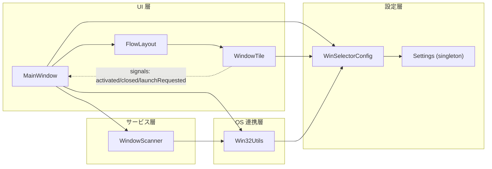

# 02 アーキテクチャ概要

## 2.1 フレームワーク・主要ライブラリ

- 言語: C++17(`CMAKE_CXX_STANDARD 17`、必須指定) [REF: CMakeLists.txt:9-10]。
- UI: Qt6 Widgets。`find_package` は Qt6 優先で Qt5 もフォールバック対象
  [REF: CMakeLists.txt:12-13]。
- 国際化: Qt LinguistTools と `*.ts` 翻訳ファイル
  [REF: CMakeLists.txt:12-15]。
- Win32: `user32`(ウィンドウ操作)、`gdi32`(GDI/アイコン)、`psapi`
  (プロセス情報)、`shell32`(`ShellExecuteExW`)をリンク
  [REF: CMakeLists.txt:50-52]。
- ビルド補助: `AUTOUIC`(`*.ui`)、`AUTOMOC`(`Q_OBJECT`)、`AUTORCC`(`*.qrc`)
  を有効化 [REF: CMakeLists.txt:5-7]。

## 2.2 アーキテクチャパターン

本アプリは Qt Widgets の標準的な「ウィジェット+シグナル/スロット」構成を採り、
明示的な MVC/MVVM フレームワークは導入していない [CONFIDENCE: HIGH]。役割分担は
レイヤ的で、UI ウィジェットと OS 連携ロジックが分離されている点が特徴である。

- **UI 層**: `MainWindow` が全体を統括し、`WindowTile` と `FlowLayout` を保持
  する [REF: src/mainwindow.h:45-50]。
- **走査/サービス層**: `WindowScanner` が純粋な列挙サービス(静的メソッドのみ)
  [REF: src/windowscanner.h:31-39]。
- **OS 連携層**: `Win32Utils` が Win32 API を全面的にラップし、エラーチェックと
  ロギングを集約する [REF: src/win32utils.h:8-13]。UI 層は生の Win32 API を直接
  叩かず、原則この層を経由する [REF: src/mainwindow.cpp:200-225]。
- **設定層**: `Settings` シングルトン+`WinSelectorConfig` インライン関数群で、
  実行時パラメータを一元化する [REF: src/config.h:6-7]。

イベント伝達は Qt のシグナル/スロットで疎結合化されている。`WindowTile` は自身の
操作を `activated`/`closed`/`launchRequested` の 3 シグナルで通知し、
`MainWindow` がスロットで受けて `Win32Utils` を呼ぶ
[REF: src/windowtile.h:57-74] [REF: src/mainwindow.cpp:146-148]:

```cpp
// src/mainwindow.cpp:146-148
connect(tile, &WindowTile::activated, this, &MainWindow::activateWindow);
connect(tile, &WindowTile::closed, this, &MainWindow::closeWindow);
connect(tile, &WindowTile::launchRequested, this, &MainWindow::launchProcess);
```



## 2.3 ディレクトリ構成

| パス | 責務 |
|---|---|
| `src/main.cpp` | エントリポイント・翻訳セットアップ [REF: src/main.cpp:13-31] |
| `src/mainwindow.*` | ルートウィンドウ・タイル管理・トレイ・ホットキー [REF: src/mainwindow.h:23-120] |
| `src/windowscanner.*` | 可視ウィンドウ列挙・`WindowInfo` 生成 [REF: src/windowscanner.h:31-39] |
| `src/windowtile.*` | 個別タイルウィジェット・ユーザ操作 [REF: src/windowtile.h:14-104] |
| `src/flowlayout.*` | 縦並び・列折り返しレイアウト [REF: src/flowlayout.h:14-166] |
| `src/win32utils.*` | Win32 API ラッパ群 [REF: src/win32utils.h:14-149] |
| `src/settings.*` | `Settings.ini` の読み書き・キー変換 [REF: src/settings.h:7-51] |
| `src/config.h` | 設定アクセサ(`Settings` への薄いラッパ) [REF: src/config.h:9-53] |
| `src/mainwindow.ui` | `QMainWindow` のベースフォーム [REF: src/mainwindow.ui:3-28] |
| `resources/` | アイコン・翻訳・リソース定義 [REF: CMakeLists.txt:33] |

命名規約は Qt 慣習に従う。メンバ変数は `m_` 接頭辞(例 `m_flowLayout`,
`m_trayIcon`) [REF: src/mainwindow.h:46-119]、静的キャッシュは `s_` 接頭辞
(`s_iconCache`) [REF: src/win32utils.cpp:12] を用いる。

## 2.4 依存関係と境界

- **外部サービス**: なし。ネットワーク連携は存在せず、配布時も `--no-network`
  指定で Qt ネットワーク機能を除外している [REF: CMakeLists.txt:77]。
- **OS 境界**: すべて `Win32Utils` 経由に集約。ただし `WindowScanner` は
  `EnumWindows` と `GetWindowThreadProcessId` を直接呼ぶ例外がある
  [REF: src/windowscanner.cpp:40-69]。また `MainWindow` はホットキー受信のため
  `nativeEvent` で生の `WM_HOTKEY` を処理する [REF: src/mainwindow.cpp:252-264]。
- **ローカルストア**: 永続データは `Settings.ini`(`QSettings`, IniFormat)のみ
  [REF: src/settings.cpp:13]。実行時のアイコンは静的 `QMap<HWND,QIcon>` の
  メモリキャッシュで保持される [REF: src/win32utils.cpp:12]。
- **主要ドメイン型**: `WindowInfo` 構造体(`hwnd`/`title`/`icon`/`processName`/
  `processId`/`processPath`)が UI と走査層を結ぶデータ単位
  [REF: src/windowscanner.h:12-26]。等価判定は `hwnd`+`title`+`processId` で
  行う [REF: src/windowscanner.h:21-25]:

```cpp
// src/windowscanner.h:12-20
struct WindowInfo {
    HWND hwnd; QString title; QIcon icon;
    QString processName; DWORD processId; QString processPath;
};
```

### 設計上の特徴(保守者向けメモ)

- `Win32Utils` は全メソッドが `static`、`Settings` は Meyers シングルトンで、
  どちらもインスタンス管理が不要 [REF: src/settings.cpp:5-9]:

```cpp
// src/settings.cpp:5-9
Settings& Settings::instance() {
    static Settings s;
    return s;
}
```
- `config.h` の各関数は毎回 `Settings::instance()` を参照するため、`Settings.ini`
  の値変更は再読込なしには反映されない(`load()` の再呼び出しが必要)
  [REF: src/config.h:14-20] [REF: src/settings.cpp:45-77]。[CONFIDENCE: HIGH]

## このチャプターで提起した詳細質問

- None

## Sources Read

- `CMakeLists.txt`
- `src/main.cpp`
- `src/mainwindow.h`
- `src/mainwindow.cpp`
- `src/windowscanner.h`
- `src/windowscanner.cpp`
- `src/windowtile.h`
- `src/flowlayout.h`
- `src/win32utils.h`
- `src/win32utils.cpp`
- `src/settings.h`
- `src/settings.cpp`
- `src/config.h`
- `src/mainwindow.ui`
