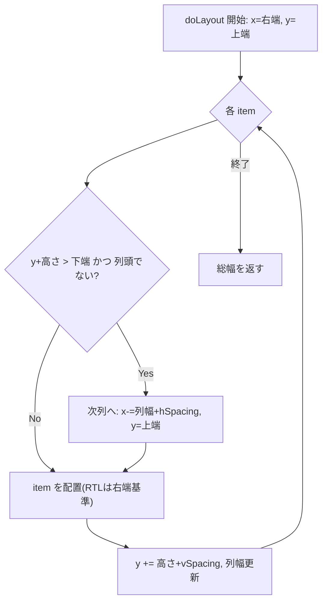

# 03 画面構成と操作

本アプリは単一のオーバーレイウィンドウ+システムトレイで構成され、画面遷移は
持たない。本章では画面要素・配置ロジック・タイルの見た目と操作対象を扱う。

## 3.1 画面一覧

| Screen ID | 画面 | 役割 | 表示条件 | 主たる状態保持 |
|---|---|---|---|---|
| SC-001 | メインオーバーレイ | 画面右端のタイルパネル | 起動時に表示、ホットキーでトグル | `MainWindow` / `FlowLayout` |
| SC-002 | タイル | 1 ウィンドウ=1 タイル | 可視ウィンドウごとに動的生成 | `WindowTile::m_info` |
| SC-003 | タイル右クリックメニュー | 「起動」「ウィンドウを閉じる」 | タイル右クリック時 | (一時) |
| SC-004 | トレイメニュー | 「Exit」 | トレイアイコン右クリック | `m_trayIcon` |

[REF: src/mainwindow.cpp:46-83] [REF: src/windowtile.cpp:99-119]
[REF: src/mainwindow.cpp:227-240]

## 3.2 ウィンドウの配置と外観

### メインオーバーレイ(SC-001)

`MainWindow::setupUi` でウィンドウ属性を設定する [REF: src/mainwindow.cpp:46-83]。

- ウィンドウフラグ: `FramelessWindowHint | WindowStaysOnTopHint | Tool`
  (枠なし・最前面・タスクバー非表示のツールウィンドウ)
  [REF: src/mainwindow.cpp:49]。
- 背景: `WA_TranslucentBackground` で半透明 [REF: src/mainwindow.cpp:50]。
- メニューバー・ステータスバーは非表示 [REF: src/mainwindow.cpp:51-58]。
- 中央ウィジェット `m_containerWidget` に `FlowLayout` を載せ、RTL(右詰め)
  モードを有効化する [REF: src/mainwindow.cpp:61-67]。
- 初期配置: 対象スクリーンの右端に、幅 `initialWidth`(既定 300px)、
  上下オフセットを差し引いた高さで配置する [REF: src/mainwindow.cpp:69-82]
  [REF: src/settings.cpp:18-21]。

### 対象スクリーンの選択(SC-001)

`getTargetScreen` が `Display/TargetDisplayIndex` 設定に基づき表示先スクリーンを
返す。インデックスが範囲外ならプライマリスクリーンへフォールバックする
[REF: src/mainwindow.cpp:280-293] [REF: src/settings.cpp:73]。

### 動的なジオメトリ調整(SC-001)

`adjustWindowGeometry` が更新ごとに必要幅を再計算し、右端基準でウィンドウを
再配置する。空状態でも極端に細くならないよう `minimumWidth`(既定 300px)を
下限とする [REF: src/mainwindow.cpp:172-198] [REF: src/settings.cpp:19]。

- 利用可能領域は `availableGeometry`(タスクバー等を除いた領域)を用いる
  [REF: src/mainwindow.cpp:174-175]。
- レイアウト高さは `layoutHeightForWindowHeight` でウィンドウ高さから非レイアウト
  分を差し引いて求める [REF: src/mainwindow.cpp:166-170]。
- 必要幅は `FlowLayout::totalWidthForHeight` から取得する
  [REF: src/mainwindow.cpp:183]。

### タイル(SC-002)の外観

`WindowTile` はアイコンラベルとタイトルラベルを水平レイアウトで並べる
[REF: src/windowtile.cpp:46-62]。

- 固定サイズ: 幅 `WindowTile/Width`(既定 250)、高さ `Height`(既定 30)
  [REF: src/windowtile.cpp:14-15] [REF: src/settings.cpp:30-31]。
- アイコン: `IconSize`(既定 16px)。アイコンが無い場合は "?" を表示
  [REF: src/windowtile.cpp:28-35] [REF: src/settings.cpp:32]。
- タイトル: 利用可能幅に合わせて `elidedText` で末尾省略し、ツールチップに
  フルタイトルを設定する [REF: src/windowtile.cpp:37-43]:

```cpp
// src/windowtile.cpp:41-43
QString elidedTitle = metrics.elidedText(m_info.title, Qt::ElideRight, availableWidth);
m_titleLabel->setText(elidedTitle);
m_titleLabel->setToolTip(m_info.title);
```
- スタイル: アクティブ時は薄青背景+青枠、非アクティブ時は白背景+灰枠。
  ホバー時はグレー背景。`setupStyle` がスタイルシートを構築する
  [REF: src/windowtile.cpp:64-83]。アクティブ状態は `setActive` で切替
  [REF: src/windowtile.cpp:85-92]。

## 3.3 レイアウト挙動(FlowLayout)

`FlowLayout` は縦方向にアイテムを積み、画面下端に達すると次の「列」へ折り返す
独自レイアウトである [REF: src/flowlayout.cpp:153-194]。

- 折り返し判定: 現在 Y にアイテム高さを足すと領域下端を超え、かつ列頭でない
  場合に次列へ移る [REF: src/flowlayout.cpp:129-137]:

```cpp
// src/flowlayout.cpp:134-136
return effectiveRect.height() > 0 &&
       currentY + itemHeight > availableBottom &&
       currentY > effectiveRect.y();
```
- RTL: `m_isRTL` が真のとき右端を基準に左方向へ列を進める。アイテム矩形は
  右端から幅を引いて配置する [REF: src/flowlayout.cpp:139-151]
  [REF: src/flowlayout.cpp:159-175]:

```cpp
// src/flowlayout.cpp:141-144
if (m_isRTL)
    item->setGeometry(QRect(QPoint(x - size.width(), y), size));
else
    item->setGeometry(QRect(QPoint(x, y), size));
```
- 必要幅算出: `totalWidthForHeight` は幅 10000 の仮想矩形で `doLayout` を
  `testOnly` 実行し、全アイテムを縦に収めたうえでの総幅を返す
  [REF: src/flowlayout.cpp:32-38]。
- 隠れたウィジェット対策: `testOnly` 時は `QWidgetItem::sizeHint()` が (0,0) を
  返すため、ウィジェットの `sizeHint()` を直接参照する
  [REF: src/flowlayout.cpp:118-127]。



### FlowLayout の QLayout インターフェース実装

`FlowLayout` は `QLayout` の必須仮想関数を実装する。保守時の参照用に対応位置を
示す。

| メソッド | 役割 | 参照 |
|---|---|---|
| コンストラクタ(parent 有/無) | 余白設定 | [REF: src/flowlayout.cpp:5-15] |
| `~FlowLayout` | 全アイテム破棄 | [REF: src/flowlayout.cpp:17-24] |
| `addItem` | アイテム追加+`invalidate` | [REF: src/flowlayout.cpp:26-30] |
| `horizontalSpacing`/`verticalSpacing` | 間隔(負値は smartSpacing) | [REF: src/flowlayout.cpp:40-56] |
| `count`/`itemAt`/`takeAt` | アイテム列アクセス | [REF: src/flowlayout.cpp:58-77] |
| `expandingDirections` | 伸長方向(なし) | [REF: src/flowlayout.cpp:79-82] |
| `hasHeightForWidth`/`heightForWidth` | 高さ依存なし(false/-1) | [REF: src/flowlayout.cpp:84-92] |
| `setGeometry` | `doLayout` 実行 | [REF: src/flowlayout.cpp:94-98] |
| `sizeHint`/`minimumSize` | 推奨/最小サイズ | [REF: src/flowlayout.cpp:100-116] |
| `smartSpacing` | スタイルから間隔取得 | [REF: src/flowlayout.cpp:196-212] |

`WindowTile` 側も固定サイズの `sizeHint`(レイアウト計算用)
[REF: src/windowtile.cpp:18-22] と、Shift+クリック設定を受け取る
`setEnableShiftClickClose` [REF: src/windowtile.cpp:94-97] を持つ。

## 3.4 ベースフォーム(mainwindow.ui)

`mainwindow.ui` は `QMainWindow` の最小フォーム(中央ウィジェット・メニューバー・
ステータスバー)を定義するのみで、実体の見た目はコードで構築される
[REF: src/mainwindow.ui:3-28]。メニューバー/ステータスバーは起動時に隠される
[REF: src/mainwindow.cpp:51-58]。`AUTOUIC` が生成する UI クラスは
`namespace Ui { class MainWindow; }` として前方宣言され、`m_ui` から参照される
[REF: src/mainwindow.h:11-16]。

## このチャプターで提起した詳細質問

- None

## Sources Read

- `src/mainwindow.cpp`
- `src/mainwindow.h`
- `src/mainwindow.ui`
- `src/windowtile.cpp`
- `src/windowtile.h`
- `src/flowlayout.cpp`
- `src/flowlayout.h`
- `src/settings.cpp`
