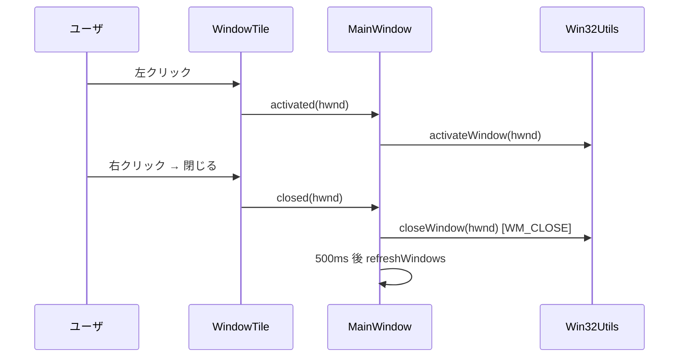

# 04 機能と振る舞い

## 4.1 機能カタログ

| Feature ID | 機能 | 起点 | ハンドラ | 概要 |
|---|---|---|---|---|
| FT-001 | ウィンドウ一覧の定期更新 | QTimer(2s) | `MainWindow::refreshWindows` | 走査→ソート→タイル更新→ジオメトリ調整 [REF: src/mainwindow.cpp:85-90] |
| FT-002 | 可視ウィンドウの走査 | `refreshWindows` | `WindowScanner::getWindows` | `EnumWindows` で列挙 [REF: src/windowscanner.cpp:66-71] |
| FT-003 | アプリ単位のグルーピング | `refreshWindows` | `fetchAndSortWindows` | プロセス名→タイトル順にソート [REF: src/mainwindow.cpp:92-108] |
| FT-004 | タイルの差分更新 | `refreshWindows` | `updateTiles` | HWND で既存タイルを再利用 [REF: src/mainwindow.cpp:110-164] |
| FT-005 | ウィンドウのアクティブ化 | タイル左クリック | `activateWindow` | 復元+前面化 [REF: src/mainwindow.cpp:200-203] |
| FT-006 | ウィンドウを閉じる | 右クリック/Shift+クリック | `closeWindow` | `WM_CLOSE`+遅延更新 [REF: src/mainwindow.cpp:205-213] |
| FT-007 | アプリの新規起動 | 右クリック「起動」 | `launchProcess` | `ShellExecuteExW` [REF: src/mainwindow.cpp:215-225] |
| FT-008 | アクティブウィンドウ強調 | `updateTiles` | `WindowTile::setActive` | 前面ウィンドウを強調 [REF: src/mainwindow.cpp:130-153] |

## 4.2 機能別フロー

### FT-001 定期更新ループ

タイマー満了で `refreshWindows` が呼ばれ、3 ステップを順に実行する:
`fetchAndSortWindows`(取得+整列)→ `updateTiles`(UI 反映)→
`adjustWindowGeometry`(再配置) [REF: src/mainwindow.cpp:85-90]。タイマー間隔は
`MainWindow/RefreshIntervalMs`(既定 2000ms) [REF: src/mainwindow.cpp:25-27]
[REF: src/settings.cpp:48]。起動直後にも一度即時実行される
[REF: src/mainwindow.cpp:33]。

### FT-002 ウィンドウ走査とフィルタ

`WindowScanner::getWindows` は `EnumWindows` にコールバック `EnumWindowsProc` を
渡して全トップレベルウィンドウを巡回する [REF: src/windowscanner.cpp:66-71]。
各ウィンドウは `isWindowRelevant` でフィルタされる [REF: src/windowscanner.cpp:5-23]:

- 不可視ウィンドウを除外(`IsWindowVisible`) [REF: src/windowscanner.cpp:7-11]。
- ツールウィンドウ(`WS_EX_TOOLWINDOW` かつ `WS_EX_APPWINDOW` でない)を除外
  [REF: src/windowscanner.cpp:15-19]:

```cpp
// src/windowscanner.cpp:15-19
LONG_PTR exStyle = GetWindowLongPtr(hwnd, GWL_EXSTYLE);
if ((exStyle & WS_EX_TOOLWINDOW) && !(exStyle & WS_EX_APPWINDOW))
    return false;
```
- "Program Manager"(デスクトップ)を除外 [REF: src/windowscanner.cpp:36-38]。
- タイトルが空でも除外せず、代わりにプロセス名をタイトルとして用いる
  [REF: src/windowscanner.cpp:50-57]。

各ウィンドウから `WindowInfo` を組み立て、プロセス名・パス・アイコンを
`Win32Utils` 経由で取得する [REF: src/windowscanner.cpp:43-61]。

### FT-003 グルーピング(ソート)

`fetchAndSortWindows` は `std::sort` で「プロセス名 → タイトル」の辞書順に整列
する。これにより同一アプリのウィンドウが連続して並ぶ
[REF: src/mainwindow.cpp:96-105]。これは Specifications.txt の「同種のアプリは
まとめて表示する」要件に対応する [REF: Specifications.txt:18]。
[CONFIDENCE: HIGH]

```cpp
// src/mainwindow.cpp:100-104
if (a.processName != b.processName)
    return a.processName < b.processName;
return a.title < b.title;
```

### FT-004 タイルの差分更新

`updateTiles` は全タイルをいったんレイアウトから外し、HWND をキーに既存タイルを
`QMap` へ退避する [REF: src/mainwindow.cpp:112-127]。新しいウィンドウ一覧を走査し:

- 既存 HWND は `setInfo` で情報更新して再利用(`take` で退避マップから取り出す)
  [REF: src/mainwindow.cpp:135-141]。
- 新規 HWND は `WindowTile` を生成し、3 シグナルを `MainWindow` のスロットへ接続
  [REF: src/mainwindow.cpp:143-149]。
- 前面ウィンドウのタイルを `setActive(true)` で強調(FT-008)
  [REF: src/mainwindow.cpp:130-153]。
- 退避マップに残った(=消滅した)タイルは破棄し、アイコンキャッシュも消す
  [REF: src/mainwindow.cpp:157-163]。

> 注: CLAUDE.md は「2 秒ごとに全タイルを再生成する」と記すが、現行実装は HWND
> ベースで既存タイルを再利用する差分更新になっている。CLAUDE.md の記述は古い
> [CONFIDENCE: HIGH; basis: src/mainwindow.cpp:110-164]。

### FT-005 アクティブ化

`WindowTile::mousePressEvent` の左クリックで `activated(hwnd)` が発火し、
`MainWindow::activateWindow` → `Win32Utils::activateWindow` を呼ぶ
[REF: src/windowtile.cpp:122-135] [REF: src/mainwindow.cpp:200-203]。詳細な
Win32 挙動(最小化復元・前面化)は CH-05 を参照。

### FT-006 ウィンドウを閉じる

閉じる経路は 2 つある:

1. 右クリックメニュー「ウィンドウを閉じる」 [REF: src/windowtile.cpp:113-118]。
2. `WindowTile/EnableShiftClickClose` が真のとき、Shift+左クリック
   [REF: src/windowtile.cpp:126-130] [REF: src/settings.cpp:35]。

いずれも `closed(hwnd)` を発火し、`MainWindow::closeWindow` が
`Win32Utils::closeWindow`(`WM_CLOSE`)を呼ぶ。続けてアイコンキャッシュを消し、
`closeRefreshDelayMs`(既定 500ms)後に `refreshWindows` を一度実行して一覧へ
反映する [REF: src/mainwindow.cpp:205-213] [REF: src/settings.cpp:17]:

```cpp
// src/mainwindow.cpp:207-212
Win32Utils::closeWindow(hwnd);
Win32Utils::clearIconCache(hwnd);
QTimer::singleShot(WinSelectorConfig::MainWindow::closeRefreshDelayMs(),
                   this, &MainWindow::refreshWindows);
```

> 仕様確定(Q-001, answered): 実装どおり `WM_CLOSE` 送信のみが正しい挙動。
> 通常終了(保存ダイアログ等を尊重)が意図であり、プロセス強制終了は要件では
> ない。Specifications.txt の「アプリプロセスを終了させる」は古い記述として扱う
> [REF: Specifications.txt:17] [REF: src/win32utils.cpp:255-271]。[CONFIDENCE: HIGH]

### FT-007 アプリの新規起動

右クリック「起動」は `m_info.processPath` が空でなければ有効化され、
`launchRequested(path)` を発火する。空パスのときメニュー項目は無効化される
[REF: src/windowtile.cpp:103-111]。`MainWindow::launchProcess` →
`Win32Utils::launchProcess` が `ShellExecuteExW` で起動し、結果を `qDebug`/
`qWarning` でログ出力する [REF: src/mainwindow.cpp:215-225]。

### FT-008 アクティブウィンドウの強調

`updateTiles` 内で `Win32Utils::getForegroundWindow` の HWND と各タイルの HWND を
比較し、一致するタイルを `setActive(true)` にする
[REF: src/mainwindow.cpp:130-153]。`setActive` は状態変化時のみスタイルを
再構築する(無駄な再描画を避ける) [REF: src/windowtile.cpp:85-92]。

## 4.3 状態・エッジケース

- 空一覧: タイルが無くても最小幅を保つ(FT-001/`adjustWindowGeometry`)
  [REF: src/mainwindow.cpp:186-189]。
- アイコン取得失敗: タイルに "?" を表示 [REF: src/windowtile.cpp:33-35]。
- 無効な HWND: `Win32Utils` 各メソッドが `isValidWindow` で早期リターンし、
  警告ログを出す [REF: src/win32utils.cpp:228-234]。
- 閉じる遅延: `WM_CLOSE` は非同期のため、即時更新ではなく 500ms 後に再走査して
  反映する [REF: src/mainwindow.cpp:210-213]。



## このチャプターで提起した詳細質問

- Q-001(answered): 「閉じる」は WM_CLOSE のみが正しい挙動(プロセス終了は要件外)。

## Sources Read

- `src/mainwindow.cpp`
- `src/windowscanner.cpp`
- `src/windowtile.cpp`
- `src/win32utils.cpp`
- `src/settings.cpp`
- `Specifications.txt`
