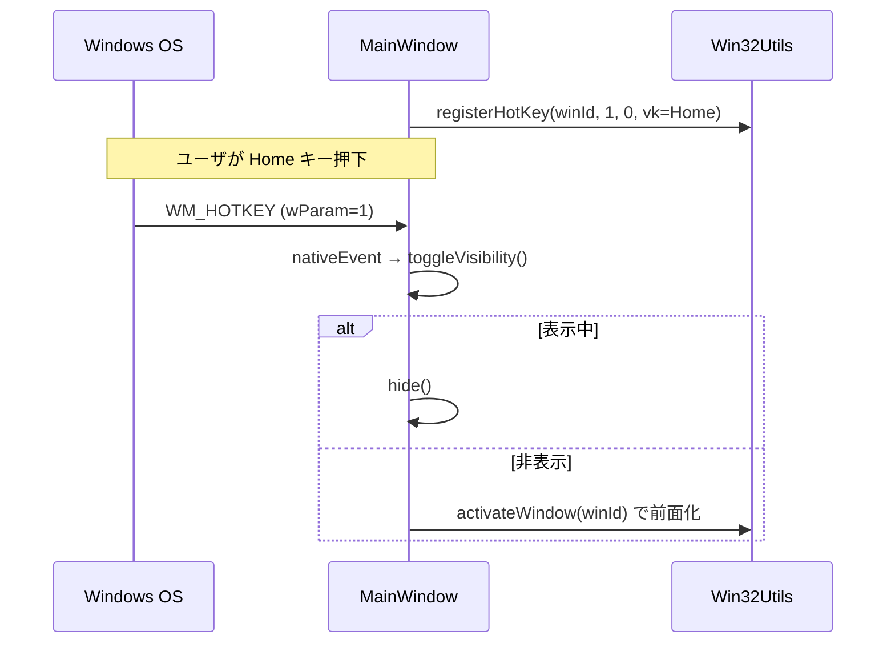

# 05 Win32 API連携・イベント

本章は「interfaces」観点の中核として、OS との境界、すなわち `Win32Utils` の各
ラッパと `MainWindow` のネイティブイベント処理を詳述する。WinSelector は外部
ネットワーク連携を持たず、唯一の外部境界が Windows OS である。

## 5.1 連携相手と方式

| 相手 | 方式 | 目的 | 失敗時の挙動 |
|---|---|---|---|
| Windows OS | EnumWindows | 可視ウィンドウ列挙 | 走査結果が空(コールバック不発) [REF: src/windowscanner.cpp:66-71] |
| プロセス | OpenProcess + Psapi | プロセス名/パス取得 | "Unknown"/空文字を返す [REF: src/win32utils.cpp:58-116] |
| ウィンドウ | WM_GETICON / GetClassLongPtr | アイコン取得 | 空 QIcon(タイルは "?") [REF: src/win32utils.cpp:153-188] |
| ウィンドウ | SetForegroundWindow / ShowWindow | アクティブ化 | false+警告ログ [REF: src/win32utils.cpp:228-253] |
| ウィンドウ | PostMessage(WM_CLOSE) | 閉じる | false+警告ログ [REF: src/win32utils.cpp:255-271] |
| シェル | ShellExecuteExW | 新規起動 | false+警告ログ [REF: src/win32utils.cpp:273-302] |
| OS | RegisterHotKey / WM_HOTKEY | グローバルホットキー | false+警告ログ [REF: src/win32utils.cpp:323-331] |
| OS | QSystemTrayIcon | トレイ常駐・再表示 | (Qt 管理) [REF: src/mainwindow.cpp:227-240] |

## 5.2 エラーハンドリング方針

`Win32Utils` は「エラーチェック・ロギング・安全確認を補う」ラッパ層という位置
づけである [REF: src/win32utils.h:8-13]。共通方針:

- `logWin32Error` が `GetLastError` の値を `qWarning` で出力する。エラーコード 0
  はログしない [REF: src/win32utils.cpp:14-26]。
- `isValidWindow`(`hwnd != nullptr && IsWindow(hwnd)`)で各操作前にハンドルを
  検証する [REF: src/win32utils.cpp:28-31]。
- システムプロセスで頻発する `ERROR_ACCESS_DENIED` はノイズ回避のためログしない
  [REF: src/win32utils.cpp:38-44]。

## 5.3 プロセス情報の取得

`openProcessAndGetModule` が `OpenProcess(PROCESS_QUERY_INFORMATION |
PROCESS_VM_READ)` でハンドルを開き、`EnumProcessModules` で先頭モジュールを得る
共通ヘルパである。失敗時はハンドルを閉じて false を返す
[REF: src/win32utils.cpp:33-56]。

- `getProcessName`: `GetModuleBaseNameW` で実行ファイル名を取得。失敗時は
  "Unknown" [REF: src/win32utils.cpp:58-86]。
- `getProcessPath`: `GetModuleFileNameExW` で完全パスを取得。失敗時は空文字
  [REF: src/win32utils.cpp:88-116]。このパスが FT-007「起動」に使われる。

いずれも取得後に `CloseHandle` を呼び、失敗時もログする
[REF: src/win32utils.cpp:80-83]。

## 5.4 アイコン取得とキャッシュ

`getWindowIcon` は静的 `s_iconCache`(`QMap<HWND,QIcon>`)を先に参照し、ヒット
すればそれを返す [REF: src/win32utils.cpp:160-165]。ミス時は次の順で取得を試みる
[REF: src/win32utils.cpp:167-180]:

1. `WM_GETICON`(ICON_BIG)→ 2. `WM_GETICON`(ICON_SMALL)→
3. `GetClassLongPtr`(GCLP_HICON)→ 4. `GetClassLongPtr`(GCLP_HICONSM)。

- `WM_GETICON` は `SendMessageTimeout`(`SMTO_ABORTIFHUNG | SMTO_BLOCK`、
  タイムアウト 200ms)で送り、ハングしたウィンドウでの固まりを防ぐ
  [REF: src/win32utils.cpp:118-130]。[CONFIDENCE: HIGH]

```cpp
// src/win32utils.cpp:124-126
if (SendMessageTimeout(hwnd, WM_GETICON, iconType, 0,
        SMTO_ABORTIFHUNG | SMTO_BLOCK, 200, &result))
    return (HICON)result;
```
- `WM_GETICON` で得られないときのフォールバックは `GetClassLongPtr` を
  `tryGetIconViaClassLongPtr` でラップし、失敗時のみエラーログを出す
  [REF: src/win32utils.cpp:132-141]。
- `HICON` → `QIcon` 変換は `QImage::fromHICON` 経由
  [REF: src/win32utils.cpp:143-151]。
- 取得結果は空でもキャッシュされる(再取得の抑制) [REF: src/win32utils.cpp:184-185]。

キャッシュ無効化は 2 系統:

- 定期: `m_iconRefreshTimer`(既定 60000ms)が `clearIconCache()` で全消去
  [REF: src/mainwindow.cpp:29-31] [REF: src/settings.cpp:22]。
- イベント: ウィンドウを閉じた時・消滅検知時に該当 HWND を個別消去
  [REF: src/mainwindow.cpp:160-162] [REF: src/mainwindow.cpp:208-209]。

`clearIconCache(nullptr)` で全消去、HWND 指定で個別消去を切り替える
[REF: src/win32utils.cpp:304-316]。

## 5.5 ウィンドウタイトルの取得

`getWindowTitle` は `Settings/WindowScanner/MaxTitleLength`(既定 256)に基づく
`std::vector<WCHAR>` バッファを確保し、`GetWindowTextW` で取得する。バッファ
オーバーフローを避ける設計 [REF: src/win32utils.cpp:190-226]
[REF: src/settings.cpp:62]。長さ 0 は必ずしもエラーではなく、空タイトルとして
扱う(`success` フラグで成否を返す) [REF: src/win32utils.cpp:209-218]。

## 5.6 ウィンドウのアクティブ化・クローズ

- `activateWindow`: 最小化されていれば `ShowWindow(SW_RESTORE)` で復元し、
  `SetForegroundWindow` で前面化する。復元失敗でも前面化は試みる
  [REF: src/win32utils.cpp:228-253]。
- `closeWindow`: `PostMessage(hwnd, WM_CLOSE, 0, 0)` を送るのみ。戻り 0 は失敗と
  みなしログする [REF: src/win32utils.cpp:255-271]。プロセス強制終了は行わない。
  これは確定仕様であり(Q-001, answered)、通常終了が意図。[CONFIDENCE: HIGH]

```cpp
// src/win32utils.cpp:237-250(activateWindow の抜粋)
if (IsIconic(hwnd)) ShowWindow(hwnd, SW_RESTORE);
if (!SetForegroundWindow(hwnd)) { logWin32Error("SetForegroundWindow"); return false; }
```
- `getForegroundWindow`: `GetForegroundWindow` の薄いラッパ。アクティブ強調
  (FT-008)に使う [REF: src/win32utils.cpp:318-321]。

## 5.7 プロセス起動

`launchProcess` は空パスと存在しないファイルを事前に弾いたうえで、
`SHELLEXECUTEINFOW` を構築し `ShellExecuteExW`(`lpVerb=L"open"`,
`nShow=SW_SHOWNORMAL`)で起動する [REF: src/win32utils.cpp:273-302]。パスは
`processPath.utf16()` を `LPCWSTR` として渡す [REF: src/win32utils.cpp:292]。

## 5.8 グローバルホットキーとネイティブイベント

ホットキーは「パネル表示トグル」用に 1 つ登録される。

- 登録: 起動時に `Win32Utils::registerHotKey((HWND)winId(), 1, 0, vk)` を呼ぶ。
  ID=1、修飾キーなし、仮想キーは設定から解決(既定 Home)
  [REF: src/mainwindow.cpp:35-37] [REF: src/settings.cpp:79-102]。
- 解除: デストラクタで `unregisterHotKey(..., 1)` を呼ぶ
  [REF: src/mainwindow.cpp:40-44]。`Win32Utils::unregisterHotKey` は
  `UnregisterHotKey` をラップし、失敗時に警告ログを出す
  [REF: src/win32utils.cpp:333-341]。
- 受信: `MainWindow::nativeEvent` が `WM_HOTKEY` を捕捉し、`wParam==1` のとき
  `toggleVisibility` を実行する [REF: src/mainwindow.cpp:252-264]:

```cpp
// src/mainwindow.cpp:255-260
if (msg->message == WM_HOTKEY) {
    if (msg->wParam == 1) { toggleVisibility(); return true; }
}
```
- トグル: 表示中なら `hide()`、非表示なら `show()`+`raise()`+
  `Win32Utils::activateWindow((HWND)winId())` で前面化する
  [REF: src/mainwindow.cpp:266-278]。



## 5.9 システムトレイ

`createTrayIcon` が `QSystemTrayIcon` を生成し、`:/icon.ico` を設定、「Exit」
アクション付きコンテキストメニューを与える [REF: src/mainwindow.cpp:227-240]。
トレイアイコンの `Trigger`(シングルクリック)で `onTrayIconActivated` が
`show()`+`raise()`+前面化を行い、隠れたパネルを呼び戻す
[REF: src/mainwindow.cpp:242-250]。

## このチャプターで提起した詳細質問

- Q-001(answered): 「閉じる」は WM_CLOSE のみが確定仕様(プロセス終了は要件外)。

## Sources Read

- `src/win32utils.h`
- `src/win32utils.cpp`
- `src/mainwindow.cpp`
- `src/windowscanner.cpp`
- `src/settings.cpp`
