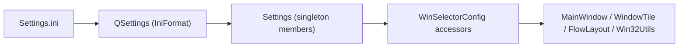

# 06 設定と永続化

## 6.1 永続化の全体像

WinSelector が永続化する状態は設定ファイル `Settings.ini` のみである。データ
ベースやユーザデータの保存は持たない。`Settings` クラスが `QSettings`
(IniFormat、ファイル名 `Settings.ini`)をラップして読み書きする
[REF: src/settings.cpp:11-13]。

- `Settings` は Meyers シングルトン(`static Settings s;`)で 1 インスタンス
  [REF: src/settings.cpp:5-9]。
- 設定値は public メンバ変数として保持され、`config.h` のアクセサ経由で参照
  される [REF: src/settings.h:14-44] [REF: src/config.h:9-53]。



## 6.2 初期化と既定値の書き出し

`Settings` のコンストラクタは、各キーが未設定なら既定値を書き込み、ユーザに
編集テンプレートを提供する。最後に `sync()` で永続化し `load()` で読み込む
[REF: src/settings.cpp:11-43]:

```cpp
// src/settings.cpp:13-16
m_settings = new QSettings("Settings.ini", QSettings::IniFormat);
if (!m_settings->contains("MainWindow/RefreshIntervalMs"))
    m_settings->setValue("MainWindow/RefreshIntervalMs", 2000);
```

| セクション/キー | 既定値 | 用途 | 参照 |
|---|---|---|---|
| MainWindow/RefreshIntervalMs | 2000 | 一覧更新間隔 | [REF: src/settings.cpp:16] |
| MainWindow/CloseRefreshDelayMs | 500 | 閉じた後の再走査遅延 | [REF: src/settings.cpp:17] |
| MainWindow/InitialWidth | 300 | 初期幅 | [REF: src/settings.cpp:18] |
| MainWindow/MinimumWidth | 300 | 最小幅 | [REF: src/settings.cpp:19] |
| MainWindow/TopOffset | 0 | 上オフセット | [REF: src/settings.cpp:20] |
| MainWindow/BottomOffset | 0 | 下オフセット | [REF: src/settings.cpp:21] |
| MainWindow/IconRefreshIntervalMs | 60000 | アイコンキャッシュ全消去間隔 | [REF: src/settings.cpp:22] |
| Layout/Margin | 2 | レイアウト余白 | [REF: src/settings.cpp:24] |
| Layout/HSpacing | 2 | 列間隔 | [REF: src/settings.cpp:25] |
| Layout/VSpacing | 2 | 行間隔 | [REF: src/settings.cpp:26] |
| WindowScanner/MaxTitleLength | 256 | タイトルバッファ長 | [REF: src/settings.cpp:28] |
| WindowTile/Width | 250 | タイル幅 | [REF: src/settings.cpp:30] |
| WindowTile/Height | 30 | タイル高さ | [REF: src/settings.cpp:31] |
| WindowTile/IconSize | 16 | アイコン辺長 | [REF: src/settings.cpp:32] |
| WindowTile/ContentMargin | 2 | タイル内余白 | [REF: src/settings.cpp:33] |
| WindowTile/InternalSpacing | 5 | アイコン-文字間隔 | [REF: src/settings.cpp:34] |
| WindowTile/EnableShiftClickClose | false | Shift+クリックで閉じる | [REF: src/settings.cpp:35] |
| Display/TargetDisplayIndex | 0 | 表示先スクリーン | [REF: src/settings.cpp:37] |
| Shortcuts/ToggleVisibility | "Home" | トグルキー | [REF: src/settings.cpp:39] |

`load()` は同じキー群を既定値付きで読み出し、各メンバへ格納する
[REF: src/settings.cpp:45-77]。

## 6.3 設定アクセサ層(config.h)

`config.h` は名前空間 `WinSelectorConfig` 配下に、`Settings::instance()` の
メンバを返すだけのインライン関数を並べる薄いアクセサ層である
[REF: src/config.h:9-53]。MainWindow/Layout/WindowScanner/WindowTile/Display の
各サブ名前空間に分かれ、UI コードはこの関数経由で設定を参照する(例
`WinSelectorConfig::MainWindow::refreshIntervalMs()`)
[REF: src/mainwindow.cpp:27] [REF: src/config.h:14]:

```cpp
// src/config.h:14
inline int refreshIntervalMs() {
    return Settings::instance().mainWindowRefreshIntervalMs;
}
```

> 注: アクセサは毎回 `Settings::instance()` のメンバを読むだけで、ファイルの
> 再読込はしない。`Settings.ini` を実行中に編集しても、`load()` を再呼び出し
> しない限り反映されない [CONFIDENCE: HIGH; basis: src/config.h:14-20]
> [REF: src/settings.cpp:45-77]。実行時に再読込を呼ぶ箇所はコード上に見当たらない。

## 6.4 ショートカットキーの解決

`Shortcuts/ToggleVisibility` 文字列(例 "Home")は `getToggleVisibilityKeyVk` で
Win32 仮想キーコードへ変換される [REF: src/settings.cpp:79-102]:

1. `QKeySequence` で文字列を解析。空なら `VK_HOME` を返す
   [REF: src/settings.cpp:81-82]。
2. 先頭コンビネーションから修飾ビットを除去してキー本体を抽出
   [REF: src/settings.cpp:98-101]。
3. `qtKeyToVk` で `Qt::Key` → 仮想キーへマッピング(A–Z、0–9、矢印、F1–F12、
   Home/End/Enter 等)。未対応キーは `VK_HOME` にフォールバック
   [REF: src/settings.cpp:104-144]:

```cpp
// src/settings.cpp:106-112
if (key >= Qt::Key_A && key <= Qt::Key_Z) return 'A' + (key - Qt::Key_A);
switch (key) {
    case Qt::Key_Home: return VK_HOME;
    // ...
}
```

この VK 値が CH-05 のホットキー登録に渡る [REF: src/mainwindow.cpp:37]。

> 注: ソース内コメントが Qt5/Qt6 でのキー抽出の不確実性に言及している
> [REF: src/settings.cpp:90-97]。修飾子マスク除去で本体キーを得る前提
> [CONFIDENCE: MED]。

## 6.5 国際化(翻訳)

`main()` はシステムの UI 言語リストを走査し、`WinSelector_<locale>` 形式の
翻訳をリソース(`:/i18n/`)から読み込んで `installTranslator` する
[REF: src/main.cpp:17-27]。翻訳定義は `resources/WinSelector_ja_JP.ts`、ビルド
時に `qt_create_translation` で `*.qm` を生成する [REF: CMakeLists.txt:15]
[REF: CMakeLists.txt:46]。

> 注: 一部の UI 文字列は `tr()` を介さずソースに直書きされている(例 タイル
> 右クリックの "起動"/"ウィンドウを閉じる") [REF: src/windowtile.cpp:104]
> [REF: src/windowtile.cpp:114]。これらは翻訳機構の対象外
> [CONFIDENCE: HIGH]。

## このチャプターで提起した詳細質問

- None

## Sources Read

- `src/settings.h`
- `src/settings.cpp`
- `src/config.h`
- `src/main.cpp`
- `src/mainwindow.cpp`
- `src/windowtile.cpp`
- `CMakeLists.txt`
