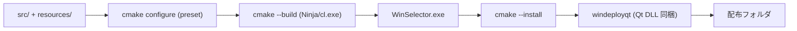

# 07 ビルドと配布

## 7.1 ビルド構成

ビルドは CMake で行う。`CMakeLists.txt` がプロジェクト定義・ソース列挙・Qt 連携・
リンク・インストール・配布を一括で担う [REF: CMakeLists.txt:1-92]。

- プロジェクト: `WinSelector` VERSION 0.1、言語 CXX [REF: CMakeLists.txt:3]。
- C++ 標準: C++17 必須 [REF: CMakeLists.txt:9-10]。
- Qt 自動処理: `AUTOUIC`/`AUTOMOC`/`AUTORCC` 有効 [REF: CMakeLists.txt:5-7]。
- Qt 検出: Qt6 優先、Qt5 フォールバック。コンポーネントは Widgets と
  LinguistTools [REF: CMakeLists.txt:12-13]。
- ソース集合 `PROJECT_SOURCES` に `src/` 各ファイルと `resources.qrc`、`*.ts` を
  列挙 [REF: CMakeLists.txt:17-35]。
- Windows のみ `resources/WinSelector.rc`(アイコンリソース)を追加
  [REF: CMakeLists.txt:37-39] [REF: resources/WinSelector.rc:1]。
- 実行ファイルは `qt_add_executable`(MANUAL_FINALIZATION)で定義し、最後に
  `qt_finalize_executable` する [REF: CMakeLists.txt:41-44]
  [REF: CMakeLists.txt:91]。
- リンク: `Qt::Widgets` に加え、Windows では `user32 gdi32 psapi shell32`
  [REF: CMakeLists.txt:48-52]。
- ターゲット属性: `WIN32_EXECUTABLE TRUE`(コンソールを出さない GUI アプリ)
  [REF: CMakeLists.txt:54-60]。

### CMake プリセット

`CMakePresets.json`(version 4、最小 CMake 3.23)が Windows 向け構成を定義する
[REF: CMakePresets.json:1-7]:

- `Default_Windows`(hidden、基底): Ninja ジェネレータ、x64、`binaryDir` は
  `build/<presetName>`、`hostSystemName == Windows` を条件とする
  [REF: CMakePresets.json:9-23]。
- コンパイラは `cl.exe`、`CMAKE_PREFIX_PATH` に `$env{QT_SDK_DIR}`、
  `compile_commands.json` 出力を ON、インストール先は `build/<presetName>/output`
  [REF: CMakePresets.json:24-30]。
- 環境: `PATH` に `$env{QT_SDK_DIR}/bin` を前置し、Qt DLL を解決
  [REF: CMakePresets.json:31-34]。
- 派生プリセット: `Debug_Windows` / `Release_Windows`(`CMAKE_BUILD_TYPE` のみ
  上書き) [REF: CMakePresets.json:41-54]。

### ビルド手順(参考)

```bash
cmake -B build -S .
cmake --build build
```

プリセット利用時はジェネレータ Ninja・コンパイラ `cl.exe` で構成される
[REF: CMakePresets.json:12-25]:

```json
"cacheVariables": {
  "CMAKE_CXX_COMPILER": "cl.exe",
  "CMAKE_PREFIX_PATH": "$env{QT_SDK_DIR}",
  "CMAKE_EXPORT_COMPILE_COMMANDS": "ON"
}
```

実行には Qt6 DLL が PATH 上にある必要がある(`QT_SDK_DIR` 経由)。
[CONFIDENCE: HIGH; basis: CMakePresets.json:27-34]



## 7.2 配布(windeployqt)

`install(TARGETS WinSelector ...)` で実行ファイルを `RUNTIME` 先へ配置する
[REF: CMakeLists.txt:62-67]。Windows では `windeployqt` を検出し、インストール
後に Qt 依存 DLL を同梱する [REF: CMakeLists.txt:70-88]。

- `windeployqt` は次のオプションで実行され、不要コンポーネントを除外して
  サイズを抑える: `--no-translations --no-opengl-sw
  --no-system-dxc-compiler --no-compiler-runtime --no-network --no-svg
  --no-system-d3d-compiler` [REF: CMakeLists.txt:77]。
- 実行結果が 0 以外なら WARNING を出す [REF: CMakeLists.txt:80-84]。
- `windeployqt` 未検出時も WARNING を出して継続(DLL は自動同梱されない)
  [REF: CMakeLists.txt:86-87]。

実行コマンドの骨子(`install(CODE ...)` 内)は次のとおり
[REF: CMakeLists.txt:75-79]:

```cmake
execute_process(
  COMMAND "${WINDEPLOYQT_EXECUTABLE}" "...WinSelector.exe"
          --no-translations --no-network --no-svg ...
  RESULT_VARIABLE deploy_result)
```

| プラットフォーム | 成果物 | 署名 | 備考 |
|---|---|---|---|
| Windows x64 | `WinSelector.exe` + Qt DLL | (定義なし) | windeployqt で依存同梱 [REF: CMakeLists.txt:70-88] |

> 注: テンプレート標準の macOS/Android/iOS 行は、本プロジェクトが Windows 専用
> のため割愛する。`MACOSX_BUNDLE` 属性は設定されているが
> [REF: CMakeLists.txt:56-58]、実際のリンク・配布は Windows 前提
> [CONFIDENCE: HIGH]。

## 7.3 リソースと国際化資産

- `resources/resources.qrc`: `icon.ico` を `/` プレフィックスで埋め込む
  [REF: resources/resources.qrc:1-6]。トレイアイコンは `:/icon.ico` を参照
  [REF: src/mainwindow.cpp:230]。
- `resources/WinSelector.rc`: 実行ファイルのアイコンリソース定義
  [REF: resources/WinSelector.rc:1]。
- `resources/WinSelector_ja_JP.ts`: 日本語翻訳定義。現状は翻訳エントリが空の
  スケルトン [REF: resources/WinSelector_ja_JP.ts:1-3]。
  [CONFIDENCE: HIGH] 実翻訳は未投入。

## 7.4 バージョニングと診断

- バージョン: `project(... VERSION 0.1 ...)` を `MACOSX_BUNDLE_*` 属性へ反映
  [REF: CMakeLists.txt:3] [REF: CMakeLists.txt:56-57]。Windows 向けの明示的な
  製品バージョン埋め込みはコード上に見当たらない [CONFIDENCE: MED]。
- 診断: 実行時ログは `qDebug`/`qWarning`(Win32 エラー等)。専用のクラッシュ
  レポートや解析基盤は存在しない [REF: src/win32utils.cpp:24]
  [REF: src/mainwindow.cpp:219-223]。

## このチャプターで提起した詳細質問

- None

## Sources Read

- `CMakeLists.txt`
- `CMakePresets.json`
- `resources/resources.qrc`
- `resources/WinSelector.rc`
- `resources/WinSelector_ja_JP.ts`
- `src/mainwindow.cpp`
- `src/win32utils.cpp`
