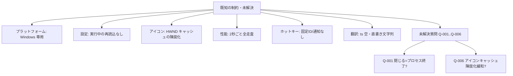

# 08 既知の制約と未解決事項

本章は保守時のリスク把握を目的に、制約・乖離・未解決質問を整理する。



## 8.1 既知の技術的制約

### プラットフォーム制約

- Windows 専用。Win32 API(`EnumWindows`、`RegisterHotKey`、`ShellExecuteExW`
  等)と Windows ライブラリに直接依存するため、他 OS では動作しない
  [REF: CMakeLists.txt:50-52] [REF: src/win32utils.cpp:1-9]。

### 設定の動的反映

- `config.h` のアクセサは `Settings::instance()` のメンバを読むのみで、実行中の
  `Settings.ini` 編集は `load()` 再呼び出しなしには反映されない。再読込を行う
  箇所はコード上に存在しない [REF: src/config.h:14-20]
  [REF: src/settings.cpp:45-77]。[CONFIDENCE: HIGH]

```cpp
// src/config.h:14 — メンバ参照のみ。ファイル再読込はしない
inline int refreshIntervalMs() { return Settings::instance().mainWindowRefreshIntervalMs; }
```

### アイコンキャッシュ

- アイコンは静的グローバル `s_iconCache`(`QMap<HWND,QIcon>`)に保持され、排他
  制御はない。GUI スレッド単一前提と推定される [REF: src/win32utils.cpp:12]
  [ASSUMED: 単一スレッド前提; basis: Qt GUI は通常メインスレッド実行]。

```cpp
// src/win32utils.cpp:12
static QMap<HWND, QIcon> s_iconCache;  // プロセス全体で共有・排他制御なし
```
- HWND は OS により再利用され得るため、閉じたウィンドウのキャッシュを消さないと
  古いアイコン(陳腐化)が残る可能性がある。ただし Q-006(answered)のとおり、
  60 秒ごとの全クリアとクローズ時の個別クリアは「アイコン変更の反映=単なる
  キャッシュ更新」が目的であり、HWND 再利用による陳腐化を意図的に防ぐ設計では
  ない。したがって HWND 再利用に伴う誤アイコン表示は潜在リスクとして残る(個別
  クリアにより部分的に低減されるのは副次的) [REF: src/mainwindow.cpp:160-162]
  [REF: src/mainwindow.cpp:208-209]。[CONFIDENCE: HIGH]

### パフォーマンス

- 2 秒ごとに全ウィンドウを走査し、各ウィンドウでプロセス情報取得とアイコン取得
  (キャッシュミス時)を行う。ウィンドウ数が多いと走査コストが増える
  [REF: src/mainwindow.cpp:85-90] [REF: src/windowscanner.cpp:66-71]。タイル自体は
  HWND ベースの差分更新で再生成を抑えている [REF: src/mainwindow.cpp:110-164]。

### ホットキーの堅牢性

- トグルホットキーは固定 ID=1・修飾なしで 1 つのみ。既に他アプリが同じキーを
  登録している場合、`RegisterHotKey` は失敗しログを残すが、ユーザへの通知は
  ない [REF: src/mainwindow.cpp:35-37] [REF: src/win32utils.cpp:323-331]。
  [CONFIDENCE: HIGH]

### 翻訳

- `WinSelector_ja_JP.ts` は空スケルトンで実翻訳が未投入
  [REF: resources/WinSelector_ja_JP.ts:1-3]。一部 UI 文字列は `tr()` を介さず
  直書きで、翻訳対象外 [REF: src/windowtile.cpp:104]
  [REF: src/windowtile.cpp:114]。

### 確定済みの設計判断(Phase 5 対話結果)

- Q-004(answered): 対象 Qt バージョンは Qt6 で確定。`getToggleVisibilityKeyVk`
  の Qt5 フォールバック記述は参考扱い [REF: src/settings.cpp:90-101]。
- Q-005(answered): `windeployqt` の除外(`--no-svg`/`--no-network` 等)は確定
  要件。SVG・ネットワーク機能は使用予定なし [REF: CMakeLists.txt:77]。
- Q-002(answered): 自動テストは未整備で、現状は手動検証中心(運用上の前提)。

## 8.2 未解決事項

未解決の質問は Question Bank で追跡し、`99-unresolved.md` にも集約する。

Phase 5 の対話により Q-001/Q-002/Q-004/Q-005/Q-006 は解決済み(answered)、
Q-003 は保留により放棄(abandoned)となった。

### Q-001(answered): 「閉じる」の挙動 = WM_CLOSE のみで確定

- 事象: Specifications.txt は「ウィンドウおよびそのアプリプロセスを終了させる」と
  記すが、実装は `PostMessage(WM_CLOSE)` のみ [REF: Specifications.txt:17]
  [REF: src/win32utils.cpp:255-271]。

```cpp
// src/win32utils.cpp:264 — 通常終了のみ。TerminateProcess は呼ばない
if (!PostMessage(hwnd, WM_CLOSE, 0, 0)) { ... }
```
- 結論(Q-001, answered): `WM_CLOSE` のみが正しい挙動。通常終了が意図であり、
  プロセス強制終了は要件ではない。Specifications.txt の「プロセスを終了させる」は
  古い記述として扱う。[CONFIDENCE: HIGH]

### Q-002(answered): テストは手動検証中心

- 結論: 自動テストは未整備で、現状は手動による動作確認が中心(運用上の前提)。

### Q-003(abandoned): 初期/更新後のジオメトリ基準領域の差

- 事象: `setupUi` は `geometry()`、`adjustWindowGeometry` は `availableGeometry()`
  を用い、タスクバー領域の扱いが異なる [REF: src/mainwindow.cpp:70-82]
  [REF: src/mainwindow.cpp:174-175]。
- 扱い: 意図の確定は保留(abandoned)。現状の推論は「初期表示は素早く全画面高で
  仮置きし、更新時に作業領域へ収める」だが [CONFIDENCE: LOW]、確証はない。改善
  検討時に再評価する。

### Q-004/Q-005/Q-006(answered)

- Q-004: 対象 Qt は Qt6 で確定 [REF: src/settings.cpp:90-101]。
- Q-005: `windeployqt` の除外は確定要件 [REF: CMakeLists.txt:77]。
- Q-006: アイコンキャッシュのクリアは単なる更新目的。HWND 再利用の陳腐化は潜在
  リスクとして残る(8.1 参照) [REF: src/win32utils.cpp:12]。

## 8.3 ドキュメントと実装の乖離(保守者向け注意)

- CLAUDE.md は「2 秒ごとに全 WindowTile を再生成する(`mainwindow.cpp:42`)」と
  記すが、現行実装は HWND ベースの差分更新であり、記述は古い
  [REF: src/mainwindow.cpp:110-164]。[CONFIDENCE: HIGH]
- CLAUDE.md は幅 300px 固定と記すが、実際は `adjustWindowGeometry` が内容に応じて
  幅を動的調整する(最小 300px) [REF: src/mainwindow.cpp:172-198]。

## このチャプターで提起した詳細質問

- Q-001, Q-002, Q-003, Q-004, Q-005, Q-006(本章で集約)

## Sources Read

- `Specifications.txt`
- `CMakeLists.txt`
- `src/win32utils.cpp`
- `src/mainwindow.cpp`
- `src/windowscanner.cpp`
- `src/config.h`
- `src/settings.cpp`
- `src/windowtile.cpp`
- `resources/WinSelector_ja_JP.ts`
